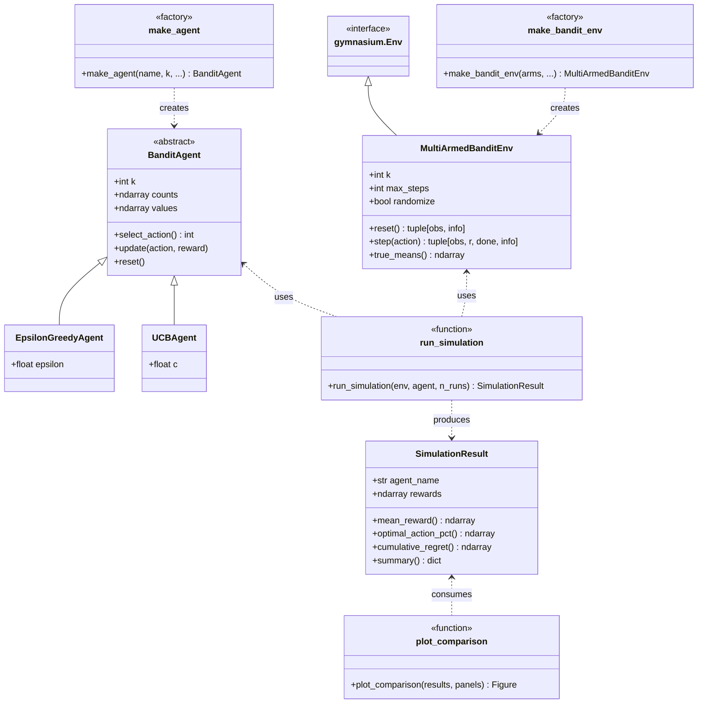
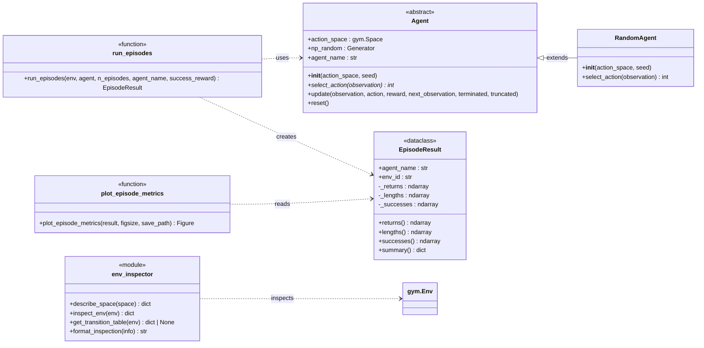

# Week 1: The Multi-Armed Bandit Problem and MDP Foundations

This module covers the foundational concepts of reinforcement learning through two complementary assignments. Part 1 builds a custom multi-armed bandit framework to study exploration vs. exploitation, while Part 2 applies those ideas to standard Gymnasium environments (FrozenLake-v1, Taxi-v3) to formalize sequential decision problems as Markov Decision Processes.

## Installation

```bash
pip install gymnasium numpy matplotlib
```

## Part 1 — Multi-Armed Bandit Framework

A Python framework for running multi-armed bandit simulations using [Gymnasium](https://gymnasium.farama.org/) and [NumPy](https://numpy.org/). It follows the Gymnasium API (`reset()` / `step()`) and supports randomized arm distributions across independent runs, matching the 10-armed testbed from Sutton & Barto Chapter 2.

### Quick start

```python
from part_01.src.factories import make_bandit_env, make_agent
from part_01.src.runner import run_simulation
from part_01.src.plotting import plot_comparison

# Create a 10-armed Gaussian bandit (means re-sampled each run)
env = make_bandit_env(k=10, dist="gaussian", randomize=True, max_steps=2000)

# Set up agents with different parameter settings
agents = [
    make_agent("epsilon_greedy", k=10, epsilon=0.01),
    make_agent("epsilon_greedy", k=10, epsilon=0.1),
    make_agent("epsilon_greedy", k=10, epsilon=0.2),
    make_agent("ucb", k=10, c=1.0),
    make_agent("ucb", k=10, c=2.0),
]

# Run 1000 independent runs of 2000 steps each
results = [run_simulation(env, agent, n_runs=1000) for agent in agents]

# Plot average reward and optimal action percentage
plot_comparison(results, panels=["reward", "optimal_pct"])
```

### Architecture

**Environment** — `MultiArmedBanditEnv` subclasses `gymnasium.Env`. Each arm has a Gaussian reward distribution. When `randomize=True`, `reset()` samples new arm means from N(0, 1) at the start of each run, while rewards within a run are drawn from N(arm_mean, 1). You can also pass explicit arm configs as dicts for custom setups.

**Agents** — `BanditAgent` is an abstract base class with `select_action()`, `update(action, reward)`, and `reset()`. Two concrete agents are provided:
- `EpsilonGreedyAgent` — exploits the best-known arm, explores randomly with probability ε
- `UCBAgent` — selects arms using Upper Confidence Bound with confidence parameter c

**Simulation runner** — `run_simulation(env, agent, n_runs)` runs multiple independent episodes, collecting per-step rewards, optimal action flags, and cumulative regret into a `SimulationResult`. Call `summary()` for a dict of final metrics.

**Visualization** — `plot_comparison(results, panels)` produces a matplotlib figure with configurable panels: `"reward"`, `"optimal_pct"`, and/or `"regret"`.

### API reference

#### Factory functions

```python
# Shorthand: randomized Gaussian testbed
env = make_bandit_env(k=10, dist="gaussian", randomize=True, max_steps=2000)

# Custom: explicit arm configs
env = make_bandit_env(arms=[
    {"dist": "gaussian", "mu": 1.0, "sigma": 0.5},
    {"dist": "gaussian", "mu": 2.0, "sigma": 1.0},
], max_steps=2000)

# Agent factory (auto-generates descriptive names for plot legends)
agent = make_agent("epsilon_greedy", k=10, epsilon=0.1)
agent = make_agent("ucb", k=10, c=2.0)
```

#### SimulationResult

```python
result = run_simulation(env, agent, n_runs=1000)

result.agent_name            # "ε-greedy (ε=0.1)"
result.mean_reward()         # ndarray, per-step average across runs
result.optimal_action_pct()  # ndarray, per-step % optimal action
result.cumulative_regret()   # ndarray, per-step average cumulative regret
result.summary()             # {"agent_name": ..., "final_regret": ..., "final_optimal_pct": ...}
```

#### Plotting

```python
# Show only reward and optimal action %
plot_comparison(results, panels=["reward", "optimal_pct"])

# Show all three panels
plot_comparison(results, panels=["reward", "optimal_pct", "regret"])
```

### Class diagram



## Part 2 — MDP Environments and Random Baseline

A modular framework for inspecting standard Gymnasium environments, mapping their structure to the MDP tuple (S, A, R, P, γ), and evaluating a random-policy baseline agent. Applied to FrozenLake-v1 (stochastic grid world) and Taxi-v3 (deterministic navigation with pickup/dropoff).

### Quick start

```python
import gymnasium as gym
from part_02.src.env_inspector import inspect_env, format_inspection, get_transition_table
from part_02.src.agents import RandomAgent
from part_02.src.runner import run_episodes
from part_02.src.plotting import plot_episode_metrics

# Inspect an environment's spaces and MDP structure
env = gym.make("FrozenLake-v1", is_slippery=True)
print(format_inspection(inspect_env(env)))

# Examine transition dynamics P(s'|s,a)
P = get_transition_table(env)

# Evaluate a random agent over 1000 episodes
agent = RandomAgent(env.action_space)
result = run_episodes(env, agent, n_episodes=1000)
print(result.summary())

# Visualize performance
plot_episode_metrics(result)
```

### Architecture

**Environment inspector** — `inspect_env(env)` returns a structured dict summarizing observation and action spaces (type, cardinality, dimensions, bounds). `get_transition_table(env)` extracts the full P(s'|s,a) table from tabular environments. `format_inspection()` renders the summary as readable text.

**Agents** — `Agent` is an abstract base class with `select_action(observation)`, `update(...)`, and `reset()`. `RandomAgent` selects actions uniformly at random, serving as a performance baseline.

**Episodic runner** — `run_episodes(env, agent, n_episodes)` runs complete episodes, collecting per-episode returns, step counts, and success flags into an `EpisodeResult`. Call `summary()` for aggregate metrics.

**Visualization** — `plot_episode_metrics(result)` produces a two-panel figure: a histogram of episode returns and a rolling success rate chart.

### MDP Tuple → Gymnasium API

| MDP Element | Symbol | Gymnasium API |
|---|---|---|
| **States** | S | `env.observation_space` / `obs` from `reset()` and `step()` |
| **Actions** | A | `env.action_space` / argument to `step(action)` |
| **Rewards** | R(s, a, s') | `reward` scalar from `step()` |
| **Transition dynamics** | P(s', r \| s, a) | `env.unwrapped.P` dict for tabular envs |
| **Discount factor** | γ | Agent/algorithm parameter (not part of env API) |

### API reference

#### Environment inspection

```python
info = inspect_env(env)           # dict with space summaries and metadata
print(format_inspection(info))    # human-readable output
P = get_transition_table(env)     # {state: {action: [(prob, next_state, reward, done)]}}
```

#### EpisodeResult

```python
result = run_episodes(env, agent, n_episodes=1000)

result.returns()     # ndarray, total return per episode
result.lengths()     # ndarray, steps per episode
result.successes()   # ndarray, boolean success per episode
result.summary()     # {"mean_return": ..., "success_rate": ..., ...}
```

### Class diagram



## Reading

- Sutton & Barto, Chapter 2 — Multi-armed Bandits
- Sutton & Barto, Chapter 3 — Finite MDPs

### Reference

Sutton, R. S., & Barto, A. G. (2018). *Reinforcement Learning: An Introduction* (2nd ed.). The MIT Press. http://incompleteideas.net/book/the-book-2nd.html

```bibtex
@book{Sutton2018,
  author    = {Sutton, Richard S. and Barto, Andrew G.},
  title     = {Reinforcement Learning: An Introduction},
  edition   = {2nd},
  publisher = {The MIT Press},
  year      = {2018},
  url       = {http://incompleteideas.net/book/the-book-2nd.html}
}
```
