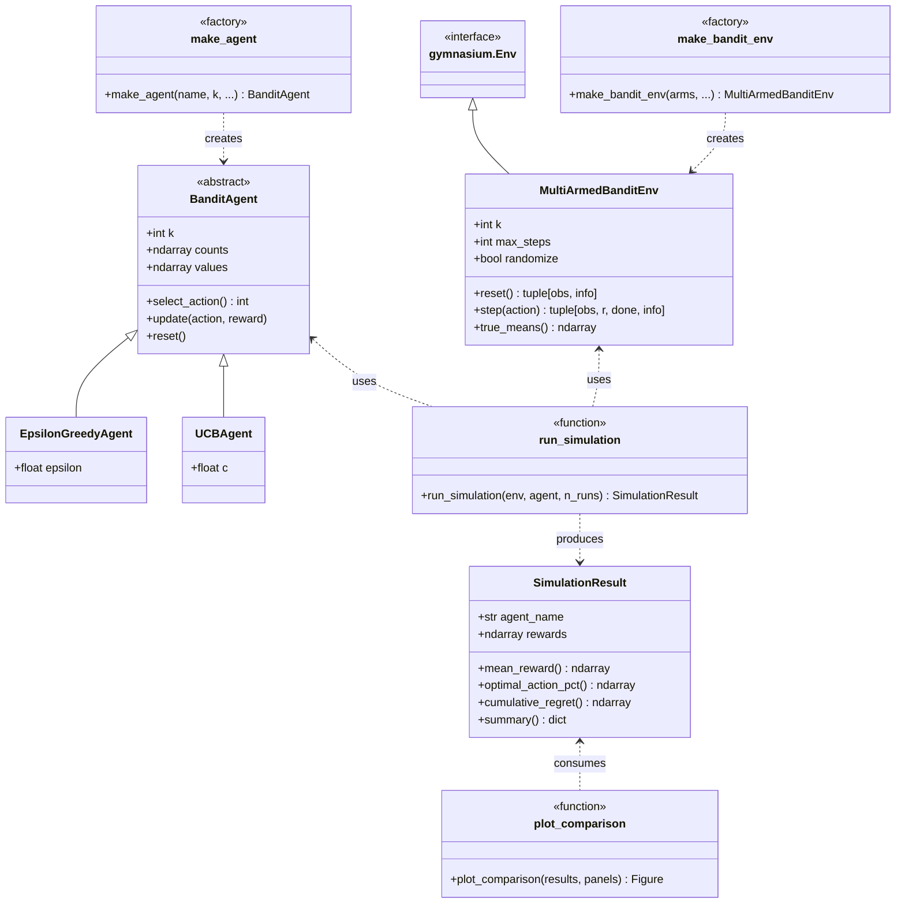

# Multi-Armed Bandit Framework

A Python framework for running multi-armed bandit simulations using [Gymnasium](https://gymnasium.farama.org/) and [NumPy](https://numpy.org/). Built for **Week 1: The Multi-Armed Bandit Problem and MDP Foundations**.

## Overview

This framework lets you configure bandit environments, run agents with different exploration strategies, and compare their performance visually. It follows the Gymnasium API (`reset()` / `step()`) and supports randomized arm distributions across independent runs, matching the 10-armed testbed from Sutton & Barto Chapter 2.

## Installation

```bash
pip install gymnasium numpy matplotlib
```

## Quick start

```python
from bandit_framework import make_bandit_env, make_agent, run_simulation, plot_comparison

# Create a 10-armed Gaussian bandit (means re-sampled each run)
env = make_bandit_env(k=10, dist="gaussian", randomize=True, max_steps=2000)

# Set up agents with different parameter settings
agents = [
    make_agent("epsilon_greedy", k=10, epsilon=0.01),
    make_agent("epsilon_greedy", k=10, epsilon=0.1),
    make_agent("epsilon_greedy", k=10, epsilon=0.2),
    make_agent("ucb", k=10, c=1.0),
    make_agent("ucb", k=10, c=2.0),
]

# Run 1000 independent runs of 2000 steps each
results = [run_simulation(env, agent, n_runs=1000) for agent in agents]

# Plot average reward and optimal action percentage
plot_comparison(results, panels=["reward", "optimal_pct"])
```

## Architecture

The framework has four components:

**Environment** — `MultiArmedBanditEnv` subclasses `gymnasium.Env`. Each arm has a Gaussian reward distribution. When `randomize=True`, `reset()` samples new arm means from N(0, 1) at the start of each run, while rewards within a run are drawn from N(arm_mean, 1). You can also pass explicit arm configs as dicts for custom setups.

**Agents** — `BanditAgent` is an abstract base class with `select_action()`, `update(action, reward)`, and `reset()`. Two concrete agents are provided:
- `EpsilonGreedyAgent` — exploits the best-known arm, explores randomly with probability ε
- `UCBAgent` — selects arms using Upper Confidence Bound with confidence parameter c

**Simulation runner** — `run_simulation(env, agent, n_runs)` runs multiple independent episodes, collecting per-step rewards, optimal action flags, and cumulative regret into a `SimulationResult`. Call `summary()` for a dict of final metrics.

**Visualization** — `plot_comparison(results, panels)` produces a matplotlib figure with configurable panels: `"reward"`, `"optimal_pct"`, and/or `"regret"`.

## API reference

### Factory functions

```python
# Shorthand: randomized Gaussian testbed
env = make_bandit_env(k=10, dist="gaussian", randomize=True, max_steps=2000)

# Custom: explicit arm configs
env = make_bandit_env(arms=[
    {"dist": "gaussian", "mu": 1.0, "sigma": 0.5},
    {"dist": "gaussian", "mu": 2.0, "sigma": 1.0},
], max_steps=2000)

# Agent factory (auto-generates descriptive names for plot legends)
agent = make_agent("epsilon_greedy", k=10, epsilon=0.1)
agent = make_agent("ucb", k=10, c=2.0)
```

### SimulationResult

```python
result = run_simulation(env, agent, n_runs=1000)

result.agent_name            # "ε-greedy (ε=0.1)"
result.mean_reward()         # ndarray, per-step average across runs
result.optimal_action_pct()  # ndarray, per-step % optimal action
result.cumulative_regret()   # ndarray, per-step average cumulative regret
result.summary()             # {"agent_name": ..., "final_regret": ..., "final_optimal_pct": ...}
```

### Plotting

```python
# Show only reward and optimal action %
plot_comparison(results, panels=["reward", "optimal_pct"])

# Show all three panels
plot_comparison(results, panels=["reward", "optimal_pct", "regret"])
```

## Lab assignment (Week 1, Part 1)

This framework directly supports the lab requirements:

1. **Custom Gymnasium environment** — `MultiArmedBanditEnv` implements `reset()` and `step()`
2. **10 arms with Gaussian rewards** — use `make_bandit_env(k=10, dist="gaussian", randomize=True)`
3. **ε-greedy and UCB agents** — implemented with NumPy
4. **2000 steps × 1000 runs** — set `max_steps=2000` and `n_runs=1000`
5. **Comparison plots** — `plot_comparison()` with configurable panels

## Reading

- Sutton & Barto, Chapter 2 — Multi-armed Bandits
- Sutton & Barto, Chapter 3 — Finite MDPs

### Reference

Sutton, R. S., & Barto, A. G. (2018). *Reinforcement Learning: An Introduction* (2nd ed.). The MIT Press. http://incompleteideas.net/book/the-book-2nd.html

```bibtex
@book{Sutton2018,
  author    = {Sutton, Richard S. and Barto, Andrew G.},
  title     = {Reinforcement Learning: An Introduction},
  edition   = {2nd},
  publisher = {The MIT Press},
  year      = {2018},
  url       = {http://incompleteideas.net/book/the-book-2nd.html}
}
```

## Architecture diagram


